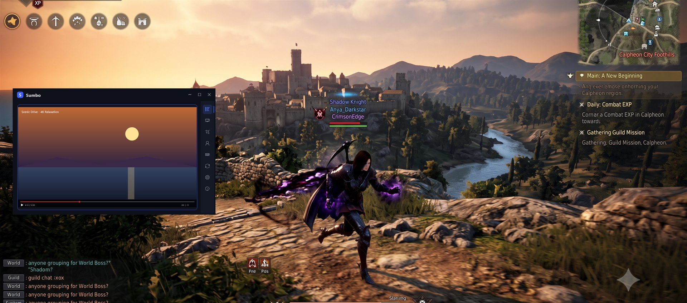
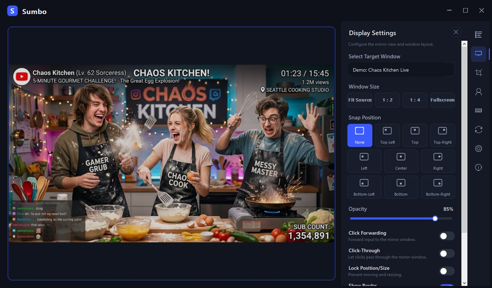
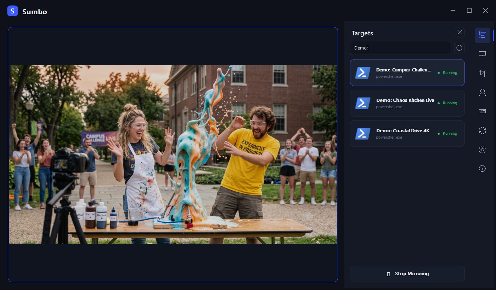
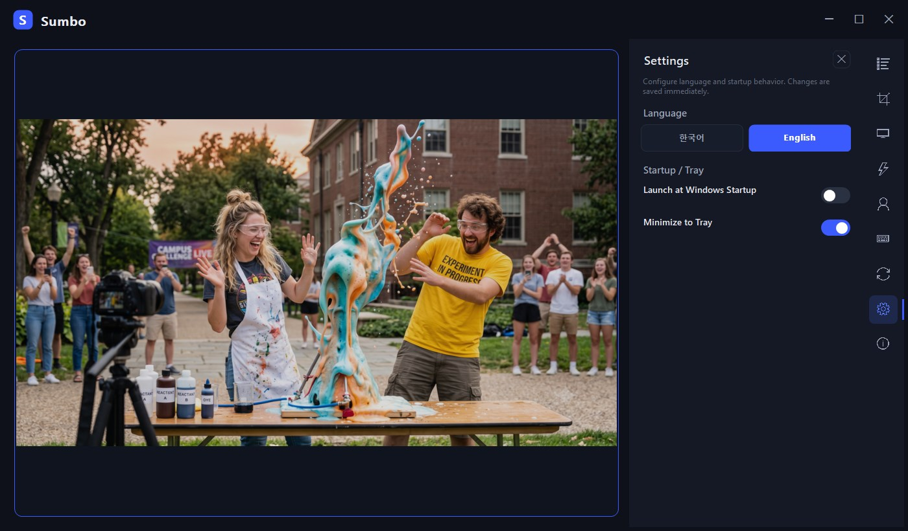

# 숨보 (Sumbo)

> 어떤 창이든 항상 위 하나의 창으로 미러링 — 자르고, 투과시키고, 클릭까지 통과.

**숨보**("숨겨서 보자")는 Windows 네이티브 DWM 썸네일로 임의의 창을 실시간
미러링하는 무료 오픈소스 유틸리티입니다. 채팅·영상·대시보드·게임 맵을 작업 화면
위에 띄워 두세요 — **원본 창에는 어떤 영향도 없습니다** (캡처·주입·성능 부하 없음).

🌐 [English README](README.md)

## 스크린샷

> 영어 인터페이스 · 예시 데이터로 표시.

**게임을 하면서 영상 시청** — 왼쪽에 고정해 두어도 게임 창에는 아무 영향이 없습니다.





|  |  |
| --- | --- |
|  |  |
|  |  |

## 주요 기능

- **단일 창 미러** — 메인 창 자체가 미러입니다. 우측 레일에서 대상을 고르면 중앙
  전체가 해당 창의 라이브 뷰가 됩니다.
- **영역 크롭** — 필요한 부분만 드래그로 선택. 저장된 영역은 상대 좌표라 원본 창
  크기가 바뀌어도 비율이 유지됩니다.
- **불투명도 10~100%** — 미러 뒤의 작업 창이 비쳐 보입니다.
- **클릭 전달** — 미러를 클릭하면 원본 창 해당 좌표로 클릭이 전달됩니다. 창 전환
  불필요.
- **클릭 통과** — 미러가 모든 입력을 무시해 아래 창을 그대로 조작할 수 있습니다
  (`Ctrl+Alt+C` 로 해제).
- **크기 프리셋·앵커** — 원본/½/¼/전체화면, 9방향 화면 고정, 위치 잠금.
- **프로필** — 대상+영역+불투명도+배치를 저장하고 한 번에 재적용.
- **그룹 순환** — 여러 창을 등록해 두고 차례로 전환 (`Ctrl+Alt+G`).
- **오버레이 모드(UI 숨김)** — 창 테두리·UI 를 감추고 미러 내용만 표시.
- **트레이 상주** — 닫기(X)는 트레이로 숨김, 종료는 트레이 메뉴에서. Windows
  시작 시 자동 실행 옵션.
- **한국어 / 영어 UI** 실시간 전환.

## 다운로드·설치

[Releases](https://github.com/koprodev/Sumbo/releases) 에서 하나를 선택하세요:

| 파일 | 크기 | 용도 |
|---|---|---|
| `Sumbo-<버전>-win-x64.msi` | ~38 MB | **설치형** — 사용자 단위 설치(관리자 권한·UAC 불필요), 시작 메뉴 등록, "앱 및 기능"에서 제거. 런타임 내장. |
| `Sumbo-<버전>-win-x64.zip` | ~45 MB | **무설치(포터블)** — 압축 해제 후 `Sumbo.exe` 실행. 런타임 내장, 설치 불필요. |
| `Sumbo-<버전>-win-x64-lite.zip` | ~0.2 MB | **경량 포터블** — 런타임 미동봉. [.NET 10 Desktop Runtime](https://dotnet.microsoft.com/download/dotnet/10.0) 필요 (없으면 첫 실행 시 Windows 가 다운로드 링크 안내). |

*(선택)* 파일 검증: PowerShell `Get-FileHash <파일>` 결과를 릴리스에 첨부된
`SHA256SUMS.txt` 와 대조.

> **SmartScreen 안내**: 릴리스 바이너리는 코드 서명이 없습니다. 첫 실행 시
> "Windows 의 PC 보호" 창이 뜨면 *추가 정보 → 실행* 을 선택하세요. 원하시면
> 아래 방법으로 소스에서 직접 빌드할 수 있습니다.

### 시스템 요구 사항

- Windows 10 / 11, 64비트(x64). DWM(데스크톱 컴포지션) 활성 — 지원 Windows
  에서는 기본 활성 상태입니다.

## 기본 단축키

| 단축키 | 동작 |
|---|---|
| `Ctrl+Alt+S` | 미러 창 표시 / 숨김 |
| `Ctrl+Alt+W` | 대상 창 선택 |
| `Ctrl+Alt+C` | 클릭 통과 토글 |
| `Ctrl+Alt+↑` / `↓` | 불투명도 증가 / 감소 |
| `Ctrl+Alt+R` | 영역 선택 |
| `Ctrl+Alt+G` | 그룹 다음 창으로 전환 |

## 개인정보

- **수집 없음 · 계정 없음 · 네트워크 통신 없음.** 숨보는 어떤 데이터도 전송하지
  않습니다.
- 업데이트는 수동 — [Releases](https://github.com/koprodev/Sumbo/releases) 에서
  새 버전을 확인하세요.

## 알려진 제한

- 관리자 권한 창에는 클릭 전달이 되지 않습니다 — Windows 가 낮은 권한
  프로세스의 입력을 차단하며, 숨보는 1회 안내를 표시합니다.
- 멀티 모니터 간 DPI 전환은 실기기 검증이 제한적입니다. 문제 발견 시
  [Issues](https://github.com/koprodev/Sumbo/issues) 로 알려 주세요.

## 소스 빌드

```powershell
winget install Microsoft.DotNet.SDK.10   # 설치 후 새 터미널
dotnet build -c Debug                    # 빌드
dotnet test                              # 단위 테스트
dotnet run --project src/Sumbo.App       # 실행

# Release 단일 파일 publish (릴리스 zip 과 동일 구성)
dotnet publish src/Sumbo.App -c Release -r win-x64 --self-contained `
  /p:PublishSingleFile=true /p:IncludeNativeLibrariesForSelfExtract=true `
  /p:DebugType=embedded -o artifacts/publish/win-x64-single

# 사용자 단위 MSI(릴리스 .msi 와 동일) — WiX 5: dotnet tool install --global wix --version 5.0.2
wix build installer/Package.wxs -arch x64 -d Version=<버전> `
  -d PublishDir=artifacts/publish/win-x64-single -d RepoDir=. `
  -o artifacts/publish/Sumbo-<버전>-win-x64.msi
```

프로젝트 구조: `src/Sumbo.App`(WinForms UI) · `src/Sumbo.Core`(도메인 로직, UI
비의존) · `src/Sumbo.Native`(DWM/User32 P/Invoke 래퍼) ·
`tests/Sumbo.Core.Tests`(xUnit).

## 후원 ☕

숨보는 광고·기능 제한 없이 언제나 무료입니다. 화면 공간과 Alt+Tab 을 아껴
드렸다면 개발을 응원해 주세요:

**[github.com/sponsors/koprodev](https://github.com/sponsors/koprodev)**

## 라이선스

MIT — [LICENSE](LICENSE) 참조. 릴리스 바이너리는 .NET 런타임을 내장합니다 —
[THIRD-PARTY-NOTICES.md](THIRD-PARTY-NOTICES.md) 참조.

창 미러링 방식은 [OnTopReplica](https://github.com/LorenzCK/OnTopReplica) 에서
영감을 받았으며, 숨보는 코드 재사용 없는 독립 신규 구현입니다.
